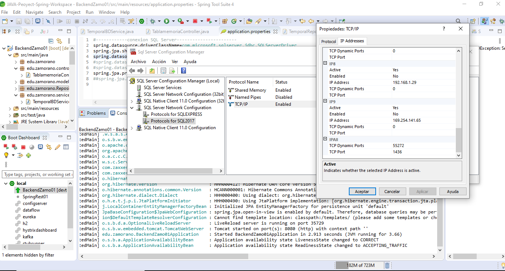
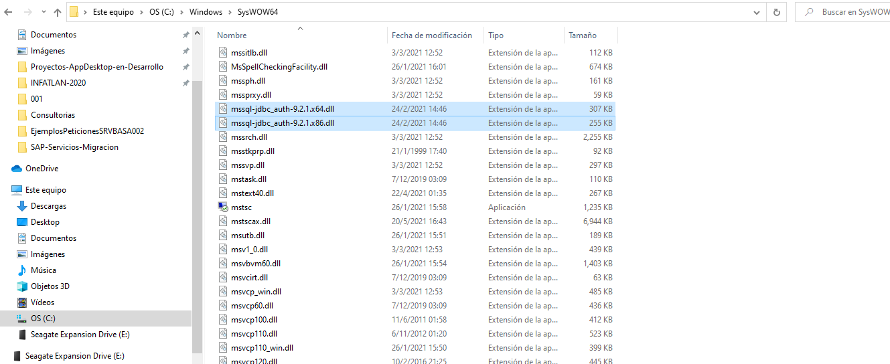
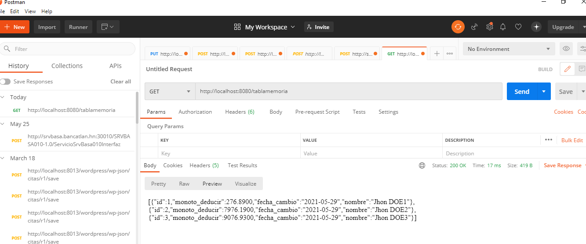
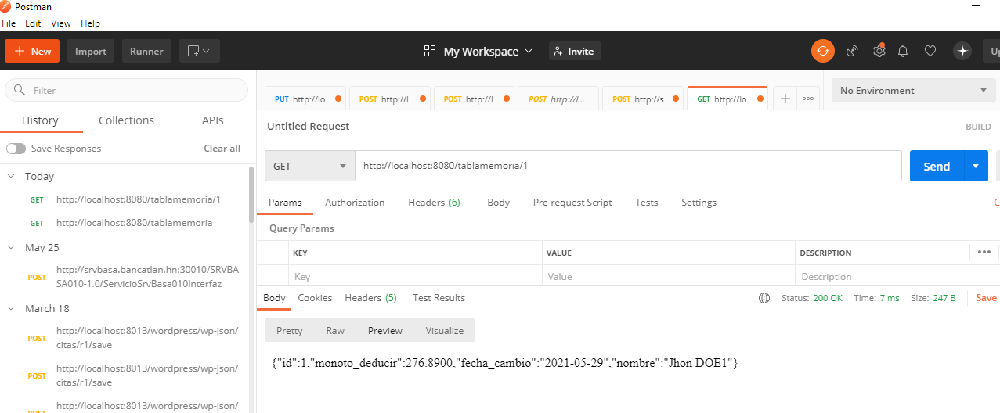
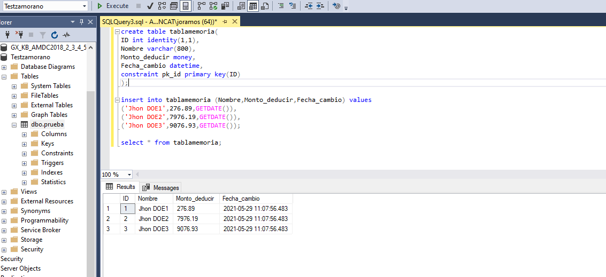
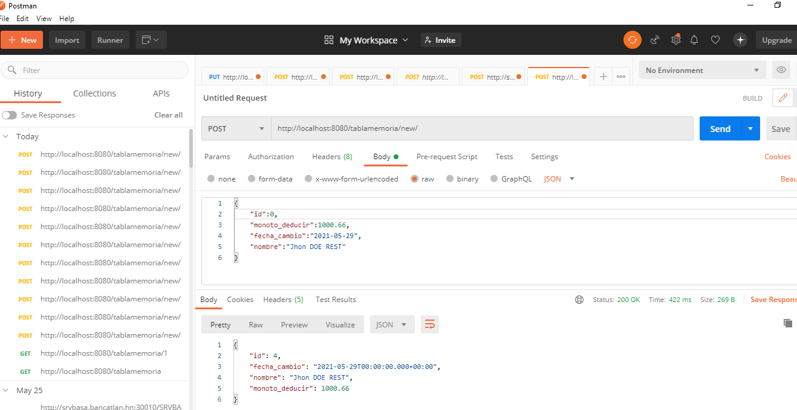
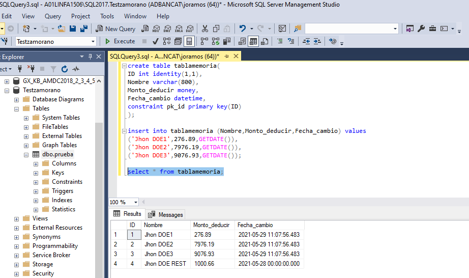
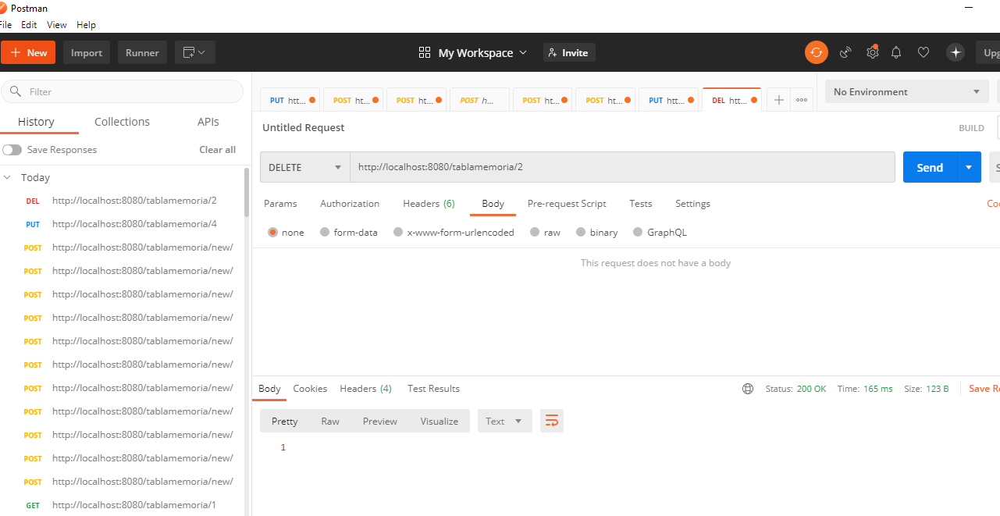
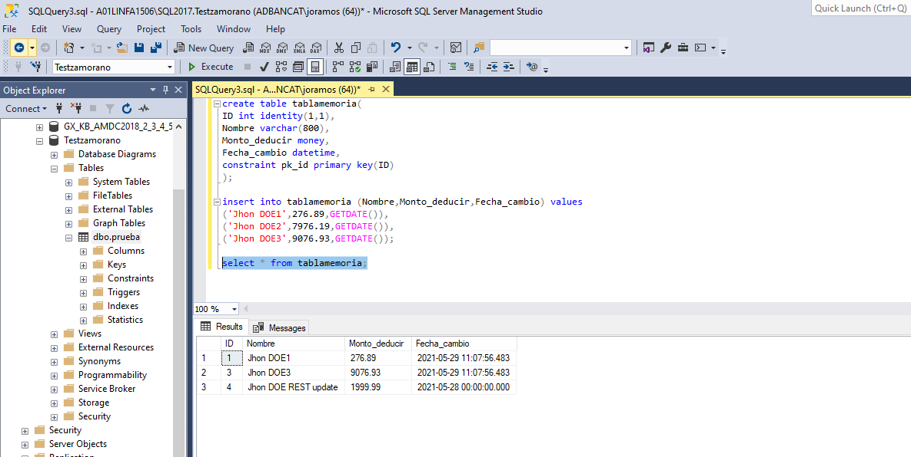

# test_JCRO_backEnd
Test para BackEnd Prueba Zamorano

-Se Utiliza Spring Boot para el Desarrollo de esta Prueba.

-Realiza todo mediante Objetos utilizando MVC, ademas gestiona las url.

-Inlcuye un servidor Apache Tomcat.

-Incluye las librerias mediante Maven para que ninguna dependcia quede sin solucionarse.

-Se recomienda cambiar en el archivo test_JCRO_backEnd\BackendZamo01\src\main\resources\application.properties
la Linea spring.datasource.url=jdbc:sqlserver://A01LINFA1506\\SQL2017:1436;databaseName=Testzamorano;integratedSecurity=true;
Puede modificarse esta linea de acuerdo a su Servidor el Puerto que utiliza y el nombre de la Base de Datos:
"A01LINFA1506\\SQL2017:1436;databaseName=Testzamorano;"

-Dentro del Proyecto podra encontrar el Script SQL
test_JCRO_backEnd\BackendZamo01\src\main\resources\sqltablatmpzamo.sql
Contiene la estructura de la Tabla y los datos de prueba.

